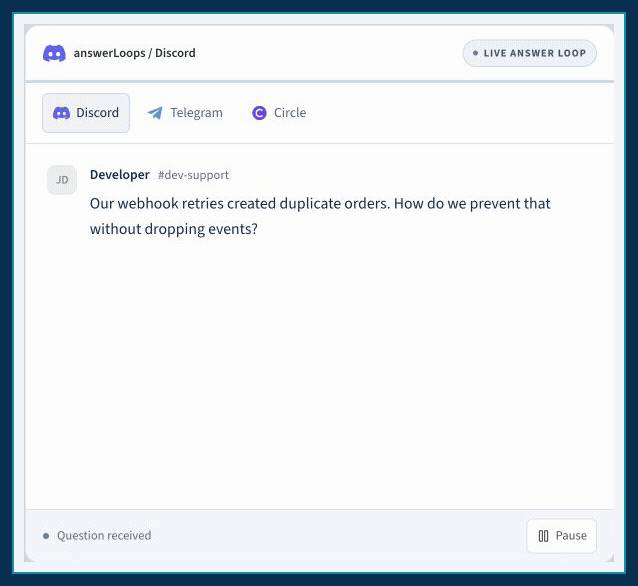
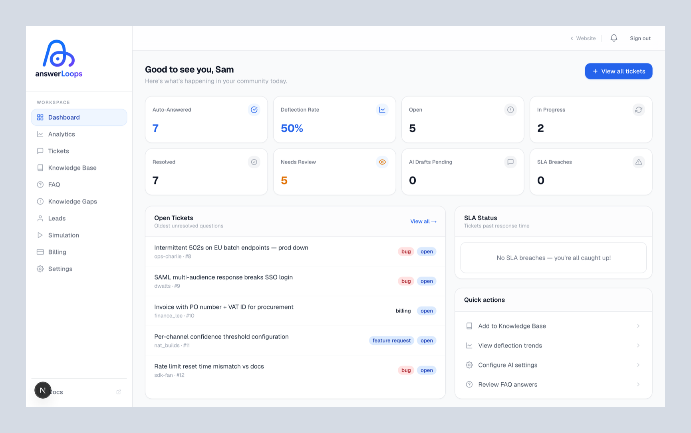
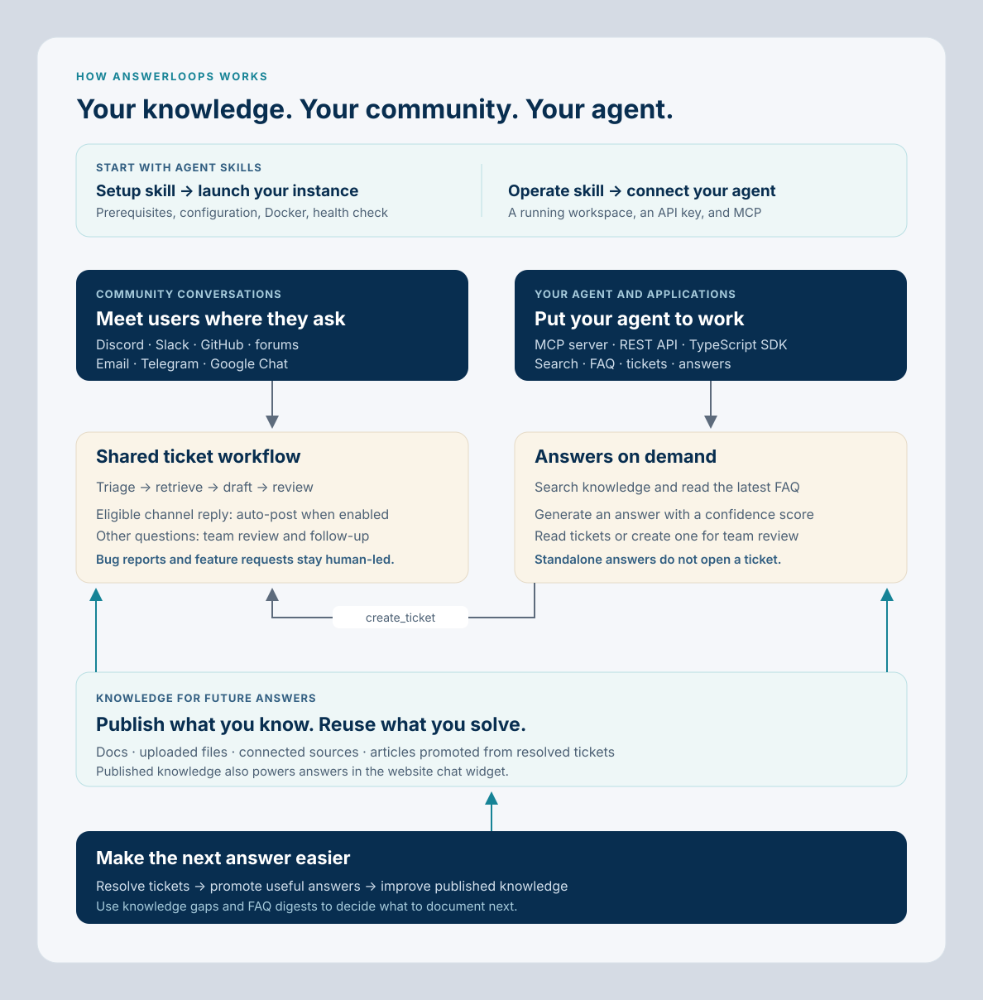
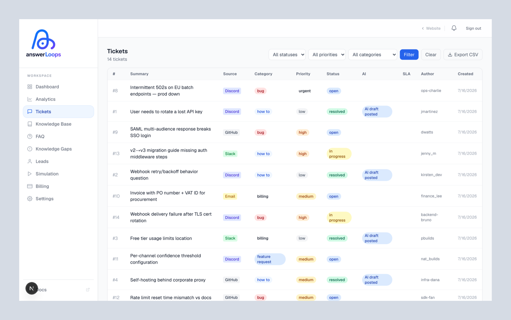
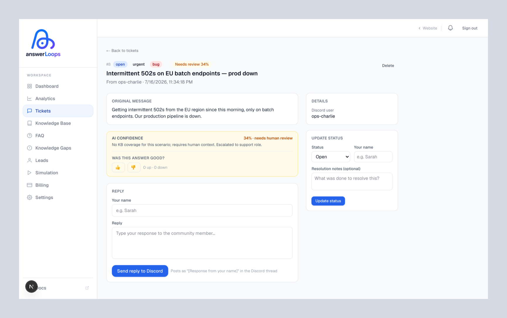

# answerLoops

### Turn your docs into answers for your community.

Answer questions in Discord, Slack, GitHub, and website chat—with source-backed replies your team can review before sending.

Self-host with your preferred model, use the hosted app, or connect your own agents through **MCP** and the API.

[**Self-host →**](#get-started) · [**Try hosted →**](https://app.answerloops.com) · [Connect your agent](#set-up-with-your-agent) · [Docs](https://answerloops.com/docs)

<a href="https://answerloops.com/#main-content">
  
</a>

*-> Question from your community -> answered from your knowledge source -> resolved tickets upgraded as content *

[](https://github.com/answerLoops/answerLoops/actions/workflows/ci.yml)
[](https://github.com/answerLoops/answerLoops/actions/workflows/security.yml)
[](./LICENSE)
[](https://www.npmjs.com/package/@answerloops/agent-sdk)


<a id="why-answerloops"></a>

## Stop answering the same question from scratch

Your docs already cover setup, troubleshooting, and the questions people ask every week. Put that knowledge to work where the conversation happens.

- **Answer from your docs.** Import documentation, files, GitHub repositories, and Notion pages. Draft replies with sources attached.
- **Review before sending.** A second AI agent checks each draft against its sources. Approve replies yourself, or enable automatic replies for qualifying questions.
- **Keep people in the loop.** Review drafts and escalations in a shared inbox. Questions that need judgment stay with your team.
- **Make the next answer better.** Save useful resolutions as knowledge-base articles and find the questions your docs don't cover.
- **Bring your own agents.** Search knowledge, generate answers, and create tickets through MCP, REST, or the TypeScript SDK.

Use it for a project's support Discord, a course community, or a product's documentation site. The same knowledge powers community replies, website chat, and your own AI tools.

<details>
<summary><strong>See the support dashboard</strong></summary>
<br />

</details>

## How it compares

| | answerLoops | Chatwoot | Zammad | Kapa.ai |
| --- | --- | --- | --- | --- |
| **License (self-hosted)** | AGPL-3.0 | AGPL-3.0 | AGPL-3.0 | No public self-hosted option |
| **Community channels** | Discord, Slack, Discourse, Circle, GitHub, Telegram, email, Google Chat, website widget | Website chat, email, WhatsApp, Telegram, Facebook, Instagram, Slack, SMS — no Discord | Email, chat, phone, WhatsApp, Facebook, Telegram — no Discord or Slack | Discord, Slack, website widget — no Telegram, Discourse, Circle, or email |
| **AI in the self-hosted tier** | Dual-agent draft-and-review pipeline included, no per-call metering | BYOK AI assistant, gated to paid/Enterprise tiers | Paid add-on even when self-hosted — €0.03 per AI call | Not applicable — hosted only |

Sources: [Chatwoot](https://www.chatwoot.com/pricing/self-hosted-plans), [Zammad](https://zammad.com/en/product/artificial-intelligence), [Kapa.ai](https://docs.kapa.ai/overview/showcase). Reviewed 2026-09-29 against each provider's published information — check current plan details before deciding.

## Get started

| Start with | Best for | First step |
| --- | --- | --- |
| **Hosted** | A managed workspace | [Open answerLoops](https://app.answerloops.com), complete onboarding, and add your knowledge. |
| **Your agent** | Guided setup or an existing workspace | Use the setup and operation skills in the guide below. |
| **Self-hosted** | Your own infrastructure | Run the CLI below, or expand the manual Docker guide. |

The CLI requires Node.js, Git, and Docker with Compose. You'll also need a PostgreSQL connection, Google OAuth credentials, and AI provider settings. Follow the [configuration guide](https://answerloops.com/docs/quickstart-self-host) for these values.

```bash
npx @answerloops/agent-sdk setup
```

The CLI checks prerequisites, clones the repository if needed, generates app secrets, and starts the published image. If configuration is missing, it tells you what to add to `.env`; add it and rerun the command. Setup verifies `/api/health` before finishing.

<a id="set-up-with-your-agent"></a>

<details>
<summary><strong>Set up with your agent</strong></summary>

### Install the agent skills

The included skills are packaged for **Claude Code**. Install both without cloning the repository:

```bash
npx @answerloops/agent-sdk skills answerloops-setup answerloops-operate
```

That writes both into `.claude/skills/` in the current directory. Install just one by naming it alone. See the [skill source](./skills) and [installation guide](https://answerloops.com/docs/integrations/agent-skills) for details. Other MCP-compatible clients can use the [MCP setup guide](https://answerloops.com/docs/integrations/mcp).

### Ask your agent to help you get running

For a new self-hosted instance:

> Use answerloops-setup to help me run answerLoops locally. Check prerequisites, walk me through the required configuration, start the stack, and verify that it is healthy.

You'll supply your sign-in configuration, database connection, and AI provider settings. The agent helps with the setup steps; you complete account creation and workspace onboarding.

For an existing hosted or self-hosted workspace:

> Use answerloops-operate to help me connect to my answerLoops workspace. Walk me through creating an API key with the permissions I need, configure MCP for my client, and verify the connection with a knowledge-base search.

### Give your agent its first support task

After connecting an AI provider and adding published knowledge, try:

> Search our knowledge base for webhook setup instructions, then generate an answer and report its confidence. If the knowledge doesn't cover the question, tell me what's missing.

Or, for an agent with ticket access:

> Summarize our open, high-priority tickets and group them by category so I can decide what to handle first.

A successful first run returns relevant knowledge or ticket results from your workspace. If a search has no matches, add or publish content that covers the question and try again.

### Connect through MCP

In **Settings → API Keys**, a workspace owner or admin can create a key and choose its permissions. Use the generated configuration in your MCP client. The endpoint is your answerLoops instance URL followed by `/api/mcp`.

| Ask your agent to… | MCP tool | Permission |
|---|---|---|
| Find an existing answer | `search_kb` | `kb:read` |
| Read the latest FAQ digest | `get_faq` | `faq:read` |
| Summarize tickets by status, priority, or category | `get_tickets` | `tickets:read` |
| Open a support ticket | `create_ticket` | `tickets:write` |
| Generate an answer with a confidence score | `generate_answer` | `answers:write` |

`generate_answer` returns an answer without opening a ticket. `create_ticket` sends a question into the shared triage and drafting workflow for your team to review in the dashboard.

[**MCP setup guide →**](https://answerloops.com/docs/integrations/mcp)

</details>

<details>
<summary><strong>Self-host with Docker manually</strong></summary>

The published image runs the app and channel listener without a local build. First download the Compose file:

```bash
curl -fsSLO https://raw.githubusercontent.com/answerLoops/answerLoops/main/docker-compose.ghcr.yml
```

Create a `.env` alongside it using the [self-hosting configuration guide](https://answerloops.com/docs/quickstart-self-host). Configure your PostgreSQL connection, app URL, generated secrets, Google OAuth sign-in, and AI provider. Then start the services:

```bash
docker compose -f docker-compose.ghcr.yml up -d
```

Images support `amd64` and `arm64`.

`latest` tracks the most recent tagged release. To pin an exact version instead:

```bash
ANSWERLOOPS_IMAGE='ghcr.io/answerloops/answerloops:<release-tag>' \
  docker compose -f docker-compose.ghcr.yml up -d
```

To modify the code, use the build-from-source instructions under [For developers](#for-developers).

</details>

## How it works

<div align="center">
  
</div>

1. **Bring in your knowledge.** Connect documentation, files, and repositories; publish the content you want available for answers.
2. **Answer where the question starts.** Draft answers for community questions, or let agents search knowledge, generate answers, and create tickets.
3. **Choose when to automate.** Enable automatic replies for eligible questions that pass confidence review. Your team reviews the rest.
4. **Build on what you solve.** Promote useful resolved tickets into published articles. Review knowledge gaps and FAQ digests to improve future answers.

For the implementation, see the [shared ingestion pipeline](./lib/ingest/pipeline.ts), [agent operations](./lib/agent/core.ts), and [architecture guide](./ARCHITECTURE.md).

<a id="integrations"></a>

## Connect your workspace

| Connect | Supported interfaces |
| --- | --- |
| **Community channels** | Discord, Slack, Discourse, Circle, GitHub Issues and Discussions, Telegram, Google Chat, email, and web chat |
| **Knowledge** | Website documentation, GitHub, Notion, PDF, DOCX, Markdown, text, CSV, and resolved tickets |
| **Agents** | Setup and operation skills, MCP, REST, OpenAPI, and the TypeScript SDK |
| **AI providers** | OpenAI, Anthropic, Google Gemini, Groq, Mistral, Ollama, and OpenAI-compatible endpoints, including local models |

The workspace includes a unified inbox, reviewed AI drafts, triage, SLA tracking, human escalation, CSAT, analytics, knowledge gaps, and FAQ digests.

[Explore the integrations →](https://answerloops.com/docs/introduction)

<details>
<summary><strong>See the unified inbox</strong></summary>
<br />

</details>

<details>
<summary><strong>See confidence review and escalation</strong></summary>
<br />

</details>

## For developers

Build your own integrations or contribute to answerLoops. Start with the [Agent API reference](https://answerloops.com/docs/integrations/agent-api), [TypeScript SDK](./packages/agent-sdk/README.md), or [architecture guide](./ARCHITECTURE.md).

<details>
<summary><strong>Build and run from source</strong></summary>

Docker Compose starts the Next.js app, the channel listener, and PostgreSQL, and runs the Drizzle migrations for you.

### Prerequisites

- Docker Engine with Docker Compose
- A Google OAuth client for dashboard sign-in
- An API key for one supported AI provider

### 1. Clone and configure

```bash
git clone https://github.com/answerLoops/answerLoops.git
cd answerLoops
cp .env.example .env
```

Generate independent secrets:

```bash
openssl rand -hex 32 # AUTH_SECRET
openssl rand -hex 32 # ENCRYPTION_KEY
openssl rand -hex 32 # BOT_SECRET
```

Then set at least these values in `.env`:

```dotenv
AUTH_URL=http://localhost:3000
AUTH_SECRET=<your-generated-auth-secret>
ENCRYPTION_KEY=<your-generated-32-byte-hex-key>
BOT_SECRET=<your-generated-bot-secret>

AUTH_GOOGLE_ID=<your-google-oauth-client-id>
AUTH_GOOGLE_SECRET=<your-google-oauth-client-secret>

OPENAI_API_KEY=<your-openai-api-key>
```

Use `http://localhost:3000/api/auth/callback/google` as the Google OAuth redirect URI. The development Compose file supplies the local `DATABASE_URL`; configure a real Postgres URL separately for production.

### 2. Start the stack

```bash
docker compose up --build
```

Open [http://localhost:3000](http://localhost:3000), sign in, and complete onboarding. To verify the server independently:

```bash
curl http://localhost:3000/api/health
# {"ok":true}
```

> [!WARNING]
> `docker compose down` stops the stack and preserves your database. Adding `-v` deletes the named Postgres volume and its data.

For deployment, provider-specific setup, and every environment variable, follow the [self-hosting documentation](https://answerloops.com/docs/quickstart-self-host).

</details>

<details>
<summary><strong>Native development and commands</strong></summary>

Use Node.js 22 (see [`.nvmrc`](./.nvmrc)) and pnpm. Running Postgres in Docker while the app processes run on the host works well:

```bash
docker compose up -d postgres
pnpm install
cp .env.example .env.local
```

In `.env.local`, set `DATABASE_URL=<your-local-postgres-connection-string>` and the other required values listed under **Build and run from source**. Next.js loads that file for the web app. To run both the web app and listener from the same shell, export it first:

```bash
set -a
source .env.local
set +a
pnpm dev:all
```

The main development commands are:

| Command | Purpose |
|---|---|
| `pnpm dev` | Start the Next.js development server |
| `pnpm bot` | Start the Discord/Slack listener in watch mode |
| `pnpm dev:all` | Run the app and listener together |
| `pnpm lint` | Run Oxlint |
| `pnpm test` | Run the Vitest unit and integration suite |
| `pnpm test:e2e` | Run Playwright end-to-end tests |
| `pnpm test:e2e:typecheck` | Type-check the Playwright suite |
| `pnpm build` | Create the production Next.js build |

</details>

<details>
<summary><strong>Repository map</strong></summary>

```text
app/                 Next.js pages, server actions, webhooks, REST, and MCP
bot/                 Discord gateway and Slack polling listener
components/          Dashboard, onboarding, marketing, and widget UI
lib/ai/              Retrieval, agents, embeddings, triage, and review
lib/ingest/          Shared multi-channel support pipeline
lib/db/              Drizzle schema, migrations, and org-scoped queries
lib/agent/           Shared operations behind MCP and REST
lib/mcp/             MCP tool definitions and protocol
packages/agent-sdk/  Typed client for the Agent API
content/docs/        Fumadocs product, integration, and self-hosting docs
skills/              Installable Claude Code skills (self-host setup, agent operation)
drizzle/             Ordered PostgreSQL migrations
tests/unit/          Vitest regression and component tests
e2e/                 Playwright end-to-end coverage
public/widget.js     Embeddable widget loader
```

Production is two processes — `app` and `bot` — built from one multi-stage image, with PostgreSQL behind them. [`ARCHITECTURE.md`](./ARCHITECTURE.md) goes through the pipeline and the data model in detail.

</details>

<details>
<summary><strong>Choose an API or SDK</strong></summary>

Bring answerLoops knowledge and support into your own application, agent, or automation. Create a workspace API key in **Settings → API Keys**, then choose your interface:

| Interface | Endpoint or package | Best for |
|---|---|---|
| MCP | `POST /api/mcp` | MCP-compatible agents and IDEs |
| REST | `/api/v1/agent/*` | Scripts, services, and custom integrations |
| OpenAPI | `GET /api/v1/agent/openapi.json` | API exploration and client generation |
| TypeScript SDK | `@answerloops/agent-sdk` | Typed Node.js and browser integrations |

MCP and REST expose the same five operations: knowledge search, FAQ lookup, ticket listing, ticket creation, and answer generation. The SDK wraps the REST API.

Generating an answer doesn't open a ticket. Creating a ticket sends the question into the team's triage and drafting workflow.

[MCP setup and permissions](https://answerloops.com/docs/integrations/mcp) · [Agent API reference](https://answerloops.com/docs/integrations/agent-api) · [SDK installation and usage](./packages/agent-sdk/README.md)

</details>

## FAQ

**Does answerLoops work with Discord and Slack at the same time?** Yes — every connected channel (Discord, Slack, Discourse, Circle, GitHub, Telegram, Google Chat, email, and the website widget) shares the same knowledge base and the same ticket queue.

**Can I run answerLoops fully self-hosted with my own LLM?** Yes. It's AGPL-3.0 and ships as a Docker Compose stack; connect OpenAI, Anthropic, Google Gemini, Groq, Mistral, Ollama, or any OpenAI-compatible endpoint, including a local model.

**Does answerLoops support MCP?** Yes — an MCP server at `/api/mcp` exposes knowledge search, FAQ lookup, ticket listing, ticket creation, and answer generation to any MCP-compatible agent, using the same dual-agent draft-and-review pipeline as every other channel.

**Does an AI-drafted answer get reviewed before it's sent?** Yes, always. A separate review agent checks every draft against its sources and assigns a confidence score. Automatic replies are off by default per channel — even a high-confidence draft waits for a person to approve it until you turn that setting on.

## Help shape answerLoops

If this is useful for your community, **star the repository** to keep it handy. Tried it with your own docs? [Open an issue](https://github.com/answerLoops/answerLoops/issues) with the workflow you tried, what worked, and where you got stuck. Don't include private support conversations or credentials.

## Contributing

Contributions are welcome. Open or link an issue to agree on the behavior before you build it.

- Scope every data-access path by organization and cover behavior changes with tests.
- Run `pnpm lint`, `pnpm test`, and `pnpm build` before pushing.
- Update the matching page under `content/docs/` when changing product behavior, architecture, setup, or an integration.

Report security issues privately through [SECURITY.md](./SECURITY.md).

## License and why self-hosted

[AGPL-3.0](./LICENSE). Read it, change it, run it yourself. If you run a modified version as a network service, the AGPL says you have to make your source available to its users.

Self-hosting means your community's questions and your documentation never leave infrastructure you control, and there's no per-resolution price to negotiate as usage grows. AGPL-3.0 specifically — not a permissive license with paid features held back — means if you or anyone else runs a modified version of answerLoops as a network service, the AGPL requires making that modified source available to its users too. That's a meaningfully stronger guarantee against a silent closed-source fork than MIT or Apache-2.0 give you, and it's why answerLoops ships as AGPL-3.0 rather than an "open core" model with the real functionality gated behind a paid tier.

<div align="center">

[Docs](https://answerloops.com/docs) · [Get started](#get-started) · [Open an issue](https://github.com/answerLoops/answerLoops/issues)

[](https://star-history.com/#answerLoops/answerLoops&Date)

</div>
