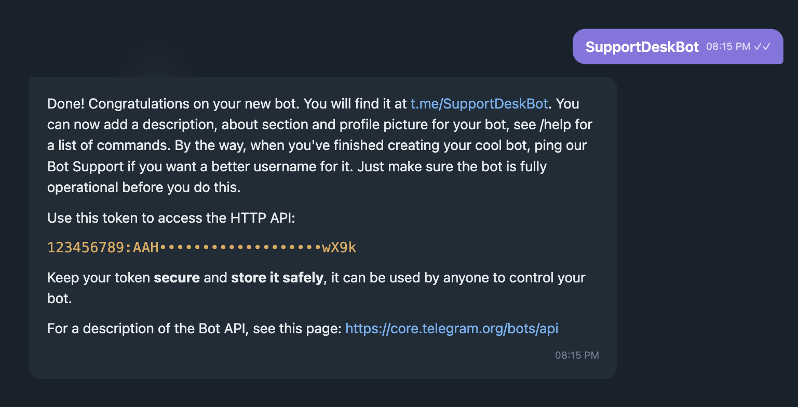

## Overview

answerLoops connects to Telegram through a bot you create and control — there's no shared platform-wide bot and no OAuth flow. Every message sent to the bot in a monitored chat (10+ characters, from a real user rather than another bot) is ingested as a ticket. The bot replies in the same chat when AI confidence is above your threshold **and Automatic Deflections is turned on**; otherwise the answer is held as a draft on the dashboard and the chat gets no reply.

Because the bot is per-organization, the token you generate with @BotFather is stored encrypted in your answerLoops database — it's never shared with other orgs, and self-hosted deployments don't need a platform-wide credential to make Telegram work. answerLoops never displays a saved token back to you in full — the Bot Token field shows only the last 4 characters (e.g. `••••wX9k (connected)`) so you can confirm which bot is connected, and typing in it replaces the token rather than editing it.

<Callout type="info">
  **Automatic Deflections** is off by default, same as every other channel. While it's off, even a high-confidence answer is held as a draft on the dashboard awaiting Approve/Edit/Dismiss, and the Telegram chat gets no automatic reply. Turn it on in **Integrations → Telegram → Edit → Automatic Deflections → Save** once you've reviewed enough approved drafts to trust the AI's answers going out unsupervised.
</Callout>

---

## Setup

### 1. Create a bot with @BotFather

Telegram bots are created by talking to Telegram's own bot, [@BotFather](https://t.me/BotFather), inside the Telegram app — there's no developer portal or web dashboard.

1. Open a chat with **@BotFather** on Telegram
2. Send `/newbot`
3. Choose a display name, then a username ending in `bot` (e.g. `AcmeSupportBot`)
4. BotFather replies with a token that looks like `123456789:AAHdqTcv...` — copy it

<Tip>
  Keep this chat open. You'll come back to BotFather later if you need to change the bot's group privacy settings (see Troubleshooting below).
</Tip>

### 2. Paste the token into answerLoops

1. Go to **Integrations → Telegram**
2. Paste the token into **Bot Token** and click **Connect**

answerLoops validates the token's format and calls Telegram's `getMe` API to confirm it's real before saving it. If it's rejected, double-check you copied the whole string including the part after the colon.

### 3. The webhook registers itself

Telegram doesn't push messages to you automatically — it has to be told where to send them. **Connect** does this for you: once the token validates, answerLoops calls Telegram's `setWebhook` API with your app's public URL (`AUTH_URL`) and a per-org secret, and Telegram starts POSTing new messages to `/api/telegram/webhook`. If that call fails (for example `AUTH_URL` isn't a publicly reachable HTTPS URL), the token is still saved and the card shows a **Register webhook** button to retry once the URL is fixed.

Once registration succeeds, the card confirms it — a green **Webhook registered `<timestamp>`** banner replaces the register prompt, with a **Re-register** button if you need to trigger it again. Saving a new bot token clears this confirmation, since a new token needs its own `setWebhook` call before Telegram will deliver to it.

<Note>
  Re-register the webhook (the **Re-register** button on the Telegram card) any time your public URL (`AUTH_URL`) changes. Rotating the bot token and re-saving registers it again automatically.
</Note>

### 4. Add the bot to a chat and find its chat ID

Add your bot to the Telegram group or supergroup you want answerLoops to monitor (or just message it directly for a 1:1 chat). By default answerLoops listens to **every** chat the bot is a member of — you only need chat IDs if you want to restrict it to specific chats.

To find a chat ID:

1. Add [@userinfobot](https://t.me/userinfobot) to the group and it will post the chat ID, or forward a message from the group to it
2. Group and supergroup chat IDs are **negative numbers** (e.g. `-1001234567890`) — this is normal, not an error

Paste one or more chat IDs, comma-separated (e.g. `-1001234567890, -1009876543210`), into **Chat IDs to monitor** on the Telegram card. Leave it blank to monitor every chat the bot is in.

### 5. Set an escalation username (optional)

If you want a human tagged when the AI isn't confident enough to auto-reply, enter a Telegram **username without the `@`** in **Escalation username**. It's referenced when a message's confidence score falls below your threshold.

### 6. Set the confidence threshold

**Confidence threshold** (0–1, default `0.8`) is the score below which an AI answer is treated as low-confidence — held as a draft (or, with Automatic Deflections on, sent along with the escalation mention instead of posted as a full answer).

### 7. Verify it's working

A registered webhook only proves Telegram *can* reach your app — it doesn't prove a message actually turns into a ticket. Group privacy mode, the 10-character filter, and a **Chat IDs to monitor** restriction can all silently swallow a message downstream of a perfectly healthy webhook, so it's worth confirming the full pipeline once rather than assuming setup is done.

Message the bot directly — a 1:1 DM skips privacy-mode filtering entirely, so it's the fastest way to rule that variable out. The message needs to be **10+ characters** and come from a real account, not another bot.

Within a few seconds a new ticket should appear in the dashboard's **Tickets** list. Since **Automatic Deflections** is off by default, the AI's answer sits there as a draft awaiting Approve/Edit/Dismiss — the Telegram chat itself gets no reply yet, which is expected, not a failure. If no ticket appears at all, see **Troubleshooting** below.

---

## Environment variables reference

Telegram is configured per-organization through the Settings UI — there's no bot-wide credential required to make it work. Both variables below are optional.

| Variable | Required | Description |
|---|---|---|
| `TELEGRAM_BOT_TOKEN` | No | Fallback bot token used only when an org hasn't saved its own token in Settings. Useful for single-tenant self-hosted deployments that want to skip the UI setup step. |
| `TELEGRAM_WEBHOOK_BASE_URL` | No | Overrides `AUTH_URL` for the Telegram webhook only. `AUTH_URL` also drives the OAuth callback host, so the two need different values whenever the app is reached at a different origin than the public tunnel — e.g. developing locally with the app on `localhost` while exposing the webhook through ngrok. Falls back to `AUTH_URL` when unset, which is correct for every normal deployment. |

---

## Troubleshooting

<AccordionGroup>
  <Accordion title="Bot Token rejected when saving">
    answerLoops checks the token against Telegram's expected format (digits, a colon, then a 35-character alphanumeric string) and also calls Telegram's `getMe` API to confirm the token is live. A rejection usually means the token was truncated when copied from BotFather, or the bot was deleted/regenerated — go back to @BotFather, send `/token` for your bot, and copy the fresh value.
  </Accordion>
  <Accordion title="Connected, but the webhook didn't register">
    Connecting calls Telegram's `setWebhook` API with your app's public URL. If `AUTH_URL` isn't set to a real, publicly reachable HTTPS URL, Telegram refuses it — `localhost` and private/internal hostnames don't work here. The token is still saved; set `AUTH_URL` to your public app URL and click **Register webhook** on the Telegram card to finish. Until then the bot receives nothing.

    If you're developing locally and need the app itself reachable on `localhost` (e.g. for an OAuth redirect that's only registered against `localhost`) while exposing the webhook through a tunnel like ngrok, don't repoint `AUTH_URL` — that breaks sign-in. Set `TELEGRAM_WEBHOOK_BASE_URL` to the tunnel's HTTPS URL instead; it overrides the webhook's base URL without touching the OAuth callback host.
  </Accordion>
  <Accordion title="Bot is in the group but never responds">
    Telegram bots run in **privacy mode** by default in group chats: they only receive messages that start with `/`, mention the bot by `@username`, or are replies to the bot's own messages — everything else is invisible to the bot even though it's in the group. If you want answerLoops to see all group messages, message @BotFather, send `/setprivacy`, select your bot, and choose **Disable**. This has no effect on 1:1 chats, which the bot always sees in full.
  </Accordion>
  <Accordion title="Messages are being ignored">
    Two filters run before a message reaches the AI pipeline: messages from other bots are always dropped, and messages under 10 characters are skipped as too short to be a real question. If you've set specific **Chat IDs to monitor**, messages from any other chat are silently ignored too — leave the field blank to monitor every chat the bot is in.
  </Accordion>
  <Accordion title="Webhook returns 401 Unauthorized">
    Every Telegram webhook call must include the secret token answerLoops registered with `setWebhook`. A 401 means either the secret has drifted out of sync (re-save the integration to generate a fresh one, then re-register the webhook) or something other than Telegram is calling the endpoint directly.
  </Accordion>
  <Accordion title="Webhook is registered, message sent, but no ticket appears">
    Work through this in order: check the app's server logs for a `POST /api/telegram/webhook` call around when you sent the message — no log line means Telegram never reached the endpoint (re-check the webhook is actually registered, and that your tunnel/URL is still live if testing locally). A log line with a 401 means the secret token is out of sync (see below). If the call succeeded (`200`) but no ticket shows, the message was filtered downstream — see **Bot is in the group but never responds** and **Messages are being ignored** above.
  </Accordion>
  <Accordion title="Escalation username isn't getting mentioned">
    The escalation username only fires when a message's AI confidence score is below **Confidence threshold**. If the AI is answering confidently every time, there's nothing to escalate — lower the threshold if you want more messages routed to a human, or check the ticket's confidence score on the dashboard to see where it's landing.
  </Accordion>
</AccordionGroup>
